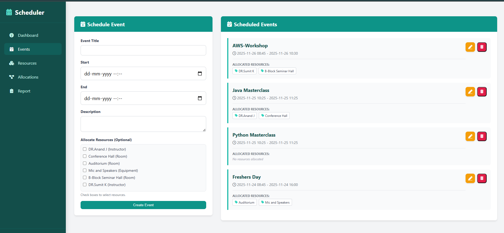
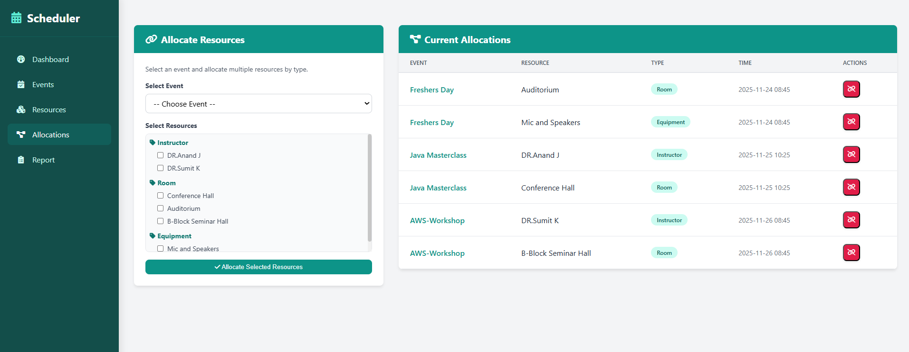
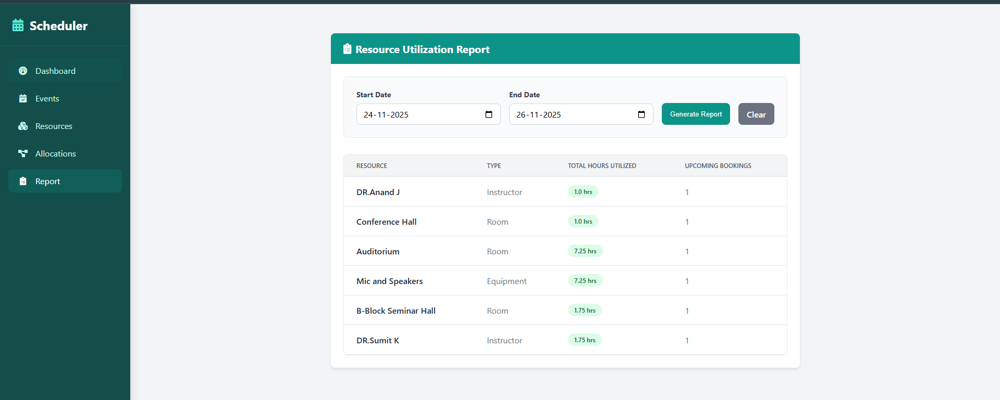

# Event Scheduler Web Application

A Flask-based event scheduling and resource management system with a clean dashboard, event manager, resource allocation, and reporting module.

## 📸 Dashboard


## 📅 Events


## 📦 Resources


## 🔗 Allocations


## 📊 Reports


## 🎥 Project Demo Video
[](https://drive.google.com/file/d/1etD6IdIkGmKkRUn_tgUQgn7aoYI8o-B1/view?usp=sharing)

## 🚀 Features
- Manage events
- Manage resources
- Allocate resources to events
- Generate date-range utilization reports
- AJAX-based dynamic UI

## 📁 Project Structure
```
project/
│── app.py
│── templates/
│── static/
│── scripts/
│── requirements.txt
│── package.json
```

## 📘 Explanation of Each File (Very Simple)

### 🧠 app.py
Main backend file handling server, routes, DB, logic.

### 📝 templates/
Contains HTML pages (dashboard, events, resources, allocations, reports).

### 🎨 static/
Contains CSS, JS, images, and icons.

### 🧩 scripts/
Holds JavaScript functions (AJAX, UI updates).

### 📦 requirements.txt
Python dependencies list.

### 📦 package.json
JavaScript dependencies (optional).

### 🗄️ schedule.db
SQLite database storing all data.

## ⚙️ Installation
```
pip install -r requirements.txt
python app.py
```
## Author
-Developed By Atheeswaran G
-Karpagam Institute of Technology
